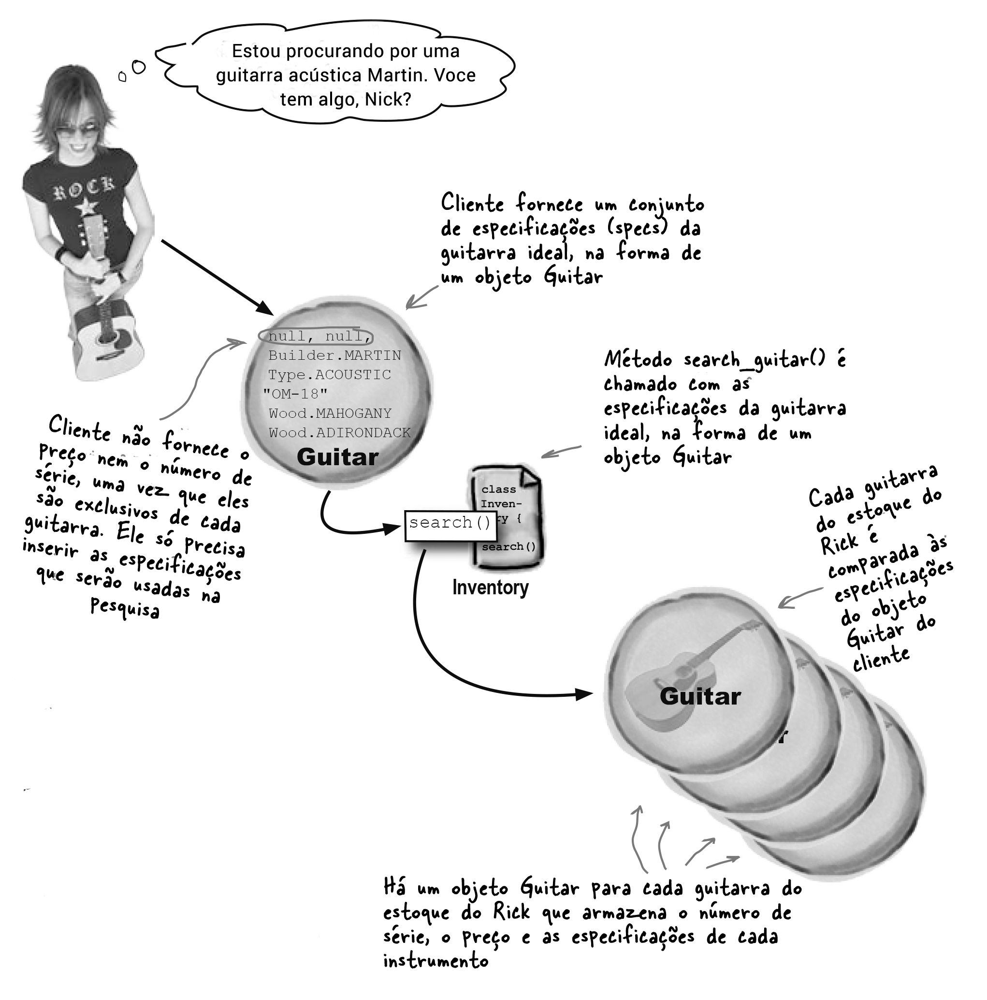

# **Grande Software Versão 2**

## **Etapa #2: Aplique os princípios básicos da OO para adicionar flexibilidade**

Agora que a aplicação (_app_) faz o que o Rick quer (**Etapa #1**), vamos começar a usar alguns princípios de OO para ter certeza de que ela é flexível e bem projetada.


## **Procurando problemas**


> Vamos nos aprofundar um pouco mais em nossa ferramenta de pesquisa e ver se podemos encontrar algum problema que alguns princípios OO simples possam ajudar a melhorar. Vamos começar dando uma olhada em como funciona o método ``search_guitar()`` na classe ``Inventory``:




## **Analise o método ``search_guitar()``**

### O que este método deveria fazer

1. O cliente informa as preferências de sua guitarra

	> O cliente só pode especificar propriedades gerais de um instrumento. Portanto ele nunca fornecerá um número de série ou um preço
> 
2. A ferramenta de pesquisa faz uma busca no estoque do Rick

	> 	Depois que a ferramenta de pesquisa sabe o que o cliente do Rick deseja, ela começa a percorrer cada guitarra no inventário de Rick.

3. Cada guitarra é comparada as preferências do cliente

	> Para cada guitarra no inventário do Rick, a ferramenta de busca verifica se aquela guitarra corresponde às preferências do cliente. Se houver, a guitarra correspondente é adicionada à lista de opções do cliente.
	
	> 	Todas as propriedades gerais, como a madeira do tampo e o fabricante da guitarra, são comparadas às preferências do cliente

4. O cliente do Rick recebe uma lista de ocorrências de guitarras

	>  	Finalmente, a lista de guitarras correspondentes é devolvida ao Rick e seu cliente. O cliente pode fazer uma escolha e Rick pode fazer uma venda
	

> **Observação**: Use uma descrição textual do problema que você está tentando resolver para garantir que seu design esteja alinhado com a funcionalidade pretendida de seu aplicativo.


A tabela abaixo mostra tipos de mistérios.

Tipo        | Descrição Mistério
:---------: | :------
1 | No mundo da POO (i.e. **Objetolândia**), os objetos possuem funções muito particulares
2 | Cada objeto está interessado em executar apenas a sua função
3 | Não há nada que um objeto bem projetado deteste mais do que ser usado para fazer algo que não seja a sua real finalidade


> Resumindo, infelizmente é isso que está acontecendo na aplicação do Rick, em algum lugar um objeto está sendo usado para fazer algo que não deveria.


### Tente resolver esse mistério seguindo as dicas:

- Os objetos devem fazer o que seus nomes indicam
	- Se um objeto for nomeado como Jet, provavelmente deve ser `takeOff()` e `land()`, mas não deve ser `takeTicket()`. Esse é o trabalho de outro objeto e não pertence a Jet
	
- Cada objeto deve representar um único conceito
	- Você não quer objetos servindo dupla ou triplamente. Evite um objeto Pato que represente um pato grasnando real, um pato de plástico amarelo e alguém abaixando a cabeça para evitar ser atingido por uma bola de beisebol  
	
- As propriedades não utilizadas são um peso morto
	- Se você tem um objeto que está sendo usado com propriedades sem valor ou nulas com frequência, provavelmente tem um objeto fazendo mais de um trabalho. Se você raramente tem valores para uma determinada propriedade, por que essa propriedade faz parte do objeto? Haveria um objeto melhor para usar apenas com um subconjunto dessas propriedades?
	

### Perguntas para serem respondidas:

```
* Qual é o objeto mal utilizado na aplicação do Rick?
* O que fazer para corrigir o problema?
* Que alterações você faria?
```

## **Corrigindo o problema**


**Frank**, **Jill** e **Joe** se reuniram e fizeram algumas anotações sobre o que discutiram. Veja abaixo.

### Observação sobre Encapsulamento

**O encapsulamento permite que você oculte o funcionamento interno das partes de seu aplicativo, mas ele deixa claro o que cada parte faz.**


### Características do Encapsulamento

1. Os clientes do Rick não estão fornecendo um objeto `Guitar`

2. Novo objeto para armazenar as especificidades dos clientes do Rick

	> Será duplicação de código?
	
3. Encapsular propriedades da Classe `Guitar` fora dela

	> Encapsulamento não é apenas transformar as variáveis em privadas para evitar o uso incorreto
	
	> Encapsulamento também está relacionado à divisão da aplicação em partes lógicas, além de mantê-las separadas

4. Dados das classes separados do resto do comportamento da aplicação

5. Propriedades genéricas de um objeto separadas das específicas


## **Alterando a classe `Guitar`(encapsulando as suas propriedades)**

Observe o diagrama abaixo da classe `Guitar`que Frank, Jill e Joe estavam discutindo e propondo como alterações.


## Grande Software Versão 2 da aplicação

### Implemente as alterações necessárias para a Loja do Rick

1. Acrescente a classe `GuitarSpec`

2. Faça as atualizações necessárias para que o software rode na Classe `Inventory`

3. Teste o sistema

